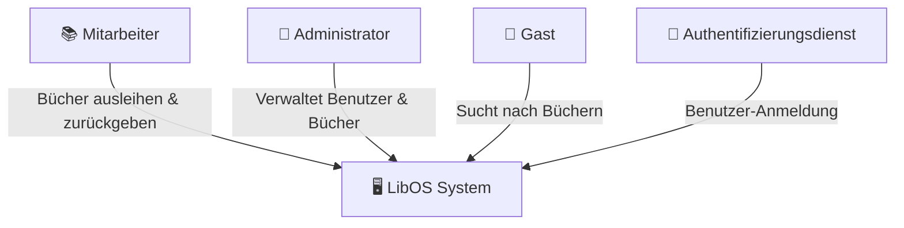
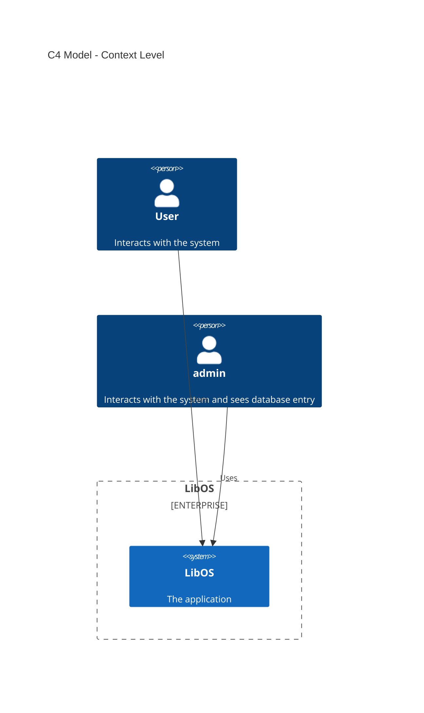
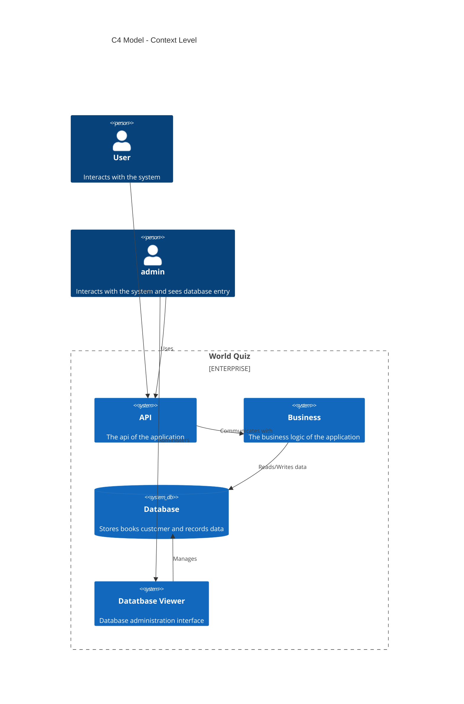
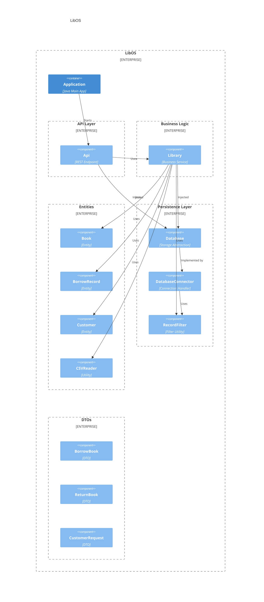

# Architektur Dokumentation

- [Einführung und Ziele](#einführung-und-ziele)
- [Randbedingungen](#randbedingungen)
- [Kontextabgrenzung](#kontextabgrenzung)
- [Lösungsstrategie](#lösungsstrategie)
- [Bausteinsicht](#bausteinsicht)
- [Laufzeitsicht](#laufzeitsicht)
- [Verteilungssicht](#verteilungssicht)
- [Querschnittsthemen](#querschnittsthemen)
- [Entwurfsentscheide](#entwurfsentscheide)
- [Qualitätsanforderungen](#qualitätsanforderungen)
- [Risiken und technische Schulden](#risiken-und-technische-schulden)
- [Glossar](#glossar)

## TODO vor Abgabe

- [ ] C4 Diagramme anpassen auf neuer Tree
- [ ] Systemkontext Diagramm ist nicht mehr aktuell (Black Box)

<!-- TODO: Übersicht über die Problemstellung (Auftrag und Ziel). -->

## Einführung und Ziele

Das **LibOS**-Projekt ist ein Library Management System. Es wird im Modul der [HSLU](https://www.hslu.ch/de-ch/) *Software Architecture and Techniques* entwickelt. Das Ziel ist es, ein Backend zur Verwaltung von Büchern, Kunden und Kundinnen und deren Ausleihe bereitzustellen.

Unser System basiert auf einer modernen Architektur mit **Java**, **Spring** und **Maven** als zentrale Technologien. Als Datenbank wird **MySQL** verwendet.

### Ziele  

Das Hauptziel von **LibOS** ist die Bereitstellung einer zuverlässigen und skalierbaren Lösung zur Verwaltung einer Bibliothek. Die Kernfunktionen umfassen:  

1. **CRUD-Operationen** für Bücher und Benutzer (z. B. Studierende).
2. **Check-in / Check-out**-Funktionalität für ausgeliehene Bücher.
3. **Benutzer-Authentifizierung** mit differenzierten Rechten (z. B. Admin, Gast).

Durch die Implementierung dieser Funktionen wird sichergestellt, dass Bibliotheken ihre Bücher effizient verwalten und Benutzer unkompliziert auf das System zugreifen können.

### Anforderungen Übersicht (Funktionale Anforderungen)

- **Buchverwaltung:** CRUD-Operationen für Bücher (Erstellen, Lesen, Aktualisieren, Löschen).
- **Benutzerverwaltung:** Verwaltung von Benutzern mit unterschiedlichen Rollen (Admin, Student, Gast).
- **Ausleihverwaltung:** Möglichkeit zur Buchausleihe und -rückgabe mit Check-in/Check-out-Funktion.
- **Authentifizierung & Autorisierung:** Benutzer müssen sich anmelden, und ihre Rechte werden überprüft.
- **Benachrichtigungen:** Erinnerungen für ausgeliehene Bücher, z. B. per E-Mail.

### Qualitätsziele (Nichtfunktionale Anforderungen)

- **Wartbarkeit** – Klare Code-Struktur und Dokumentation zur einfachen Erweiterung.
- **Skalierbarkeit:** Das System soll mit einer steigenden Anzahl von Büchern und Benutzern effizient umgehen können.
- **Sicherheit:** Schutz von Benutzerdaten durch sichere Authentifizierung und Zugriffskontrollen.
- **Performanz:** Schnelle Ladezeiten und reaktionsschnelle API-Abfragen.
- **Zuverlässigkeit:** Hohe Verfügbarkeit des Systems durch robuste Architektur.

#### Stakeholders

- **Nutzer der Bibliothek** – Hauptnutzer des Systems, die Bücher ausleihen und zurückgeben.
- **Bibliothekare / Administratoren** – Verwalten die Bibliothek, verwalten Bücher und Benutzer.
- **IT-Admin** – Verantwortlich für die Wartung und den Betrieb des Systems.
- **Entwikler API** - Möchten möglichst viel lernen.

<!-- TODO: Randbedingungen, welche bei der Lösung eingehalten werden müssen, z.B. bestehende Systeme, welche unterstützt werden müssen oder spezielle Anforderungen, welche den Lösungsraum einschränken. -->

## Randbedingungen

| **Kategorie**          | **Randbedingungen**                                                                                                                         |
|------------------------|---------------------------------------------------------------------------------------------------------------------------------------------|
| **Betriebssystem**     | Das Projekt muss auf gängigen Betriebssystemen wie **Linux, macOS und Windows** laufen.                                                     |
| **Programmiersprache** | Die **Programmiersprache** für LibOS ist **Java**, zusammen mit **Maven** als Build Tool.                                                   |
| **API Framework**      | Die API wird mit **Spring** realisiert, einem beliebten Java Framework, welches fortlaufend gewartet wird und eine grosse Community hat.    |
| **Datenbank**          | Die **Datenbank** wird mit einer MySQL Datenbank realisiert.                                                                                |
| **Modul SWAT**         | Das Projekt ist vom Modul Software Architecture and Techniques, welches im Herbstsemester 2025 an der Hochschule Luzern durchgeführt wurde. |
| **Hosting**            | Die anwendung wird Lokal must lokal gehosted werden, und mit möglichst wenig aufwand auch auf einem Server Deployed werden können.          |
| **Versionierung**      | Die Versionierung wird mit Git gemacht und der Source Code wird auf Github gehosted.                                                        |
| **Dokumentation**      | Die Dokumentation wird in Markdown geschrieben und ist ebenfalls auf Github ansehbar.                                                       |
| **Diagramme**          | Die Diagramme werden mit Mermaid gezeichnet, damit sie gut und einfach anpassbar sind.                                                      |

<!-- TODO: Anhand von Datenflüssen beschreiben wie das zu entwickelnde System eingesetzt wird.
Also Daten, welche Benutzer oder umgebende Systeme in das zu entwickelnde System einspeisen oder abgreifen.
Diese Beschreibung wird oft von einem Diagramm unterstützt, Dieses Diagram ist in VSK pflicht!
Hinweis: Hier Benutzerschnittstellen und externe Schnittstellen mit Version spezifizieren. -->

## Kontextabgrenzung

LibOS stellt ein zentrales Backend-System dar, das folgende Kernfunktionen intern abbildet:
* Verwaltung von Medien (z. B. Bücher)
* Verwaltung von Benutzerdaten (z. B. Studierende, Administratoren)
* Abwicklung von Ausleihvorgängen (Check-in / Check-out)
* Rechtebasierte Zugriffskontrolle und Autorisierung

### Systemkontext

Die nachfolgende Übersicht zeigt, welche Akteure und externen Systeme mit LibOS interagieren und welche Beziehungen bestehen:

Beschreibung der Akteure

| Akteur / System                 | Rolle im Kontext                                   |
|---------------------------------|----------------------------------------------------|
| 📚 **Mitarbeiter**              | Leiht Bücher aus und gibt sie zurück               |
| 🔧 **Administrator**            | Verwalten Medien und Benutzer, überwachen Prozesse |
| 👤 **Gast**                     | Recherchiert im Bibliothekskatalog                 |
| 🔑 **Authentifizierungsdienst** | Führt Login-Vorgänge durch und liefert Identitäten |

### Abgrenzung zu anderen Systemen

Bestimmte Systeme und Dienste liegen **außerhalb des LibOS-Systems**, können jedoch über definierte Schnittstellen angebunden werden. Sie sind **nicht Teil des Projektumfangs**, werden aber bei Bedarf berücksichtigt:

* **Frontend (Benutzeroberfläche):** Die grafische Oberfläche wird separat entwickelt oder durch externe Systeme bereitgestellt. LibOS stellt ausschließlich Backend-Funktionalität bereit.
* **Externe Medienkataloge:** LibOS beschränkt sich auf die Verwaltung lokaler Bestände; eine Anbindung an überregionale Kataloge ist nicht vorgesehen.
* **Zahlungs- und Mahnsysteme:** Die Verwaltung von Gebühren oder Mahnungen gehört nicht zum Aufgabenbereich des Systems.
* **Monitoring- und Logging-Infrastruktur:** Solche Dienste sind optional und werden nicht als zentraler Bestandteil der Systemarchitektur behandelt.

<!-- TODO: Gewählter Lösungsansatz mit Begründung beschreiben. Gefragt ist eine sehr kurze Zusammenfassung. -->

## Lösungsstrategie

Nach einer Planungsphase wurde zuerst die Infrastruktur vom Projekt eingerichtet. Dies beinhaltete zum Beispiel, das Maven Projekt aufzusetzen, grundlegende Dependencies einzubauen wie SLF4J zum Loggen oder JUnit zum Testen. Kurz darauf wurde auch die API mit Spring eingebunden und eine verbindung zu der Datenbank geschrieben. Am Anfang wurde das Testing etwas vernachlässigt. In der mitte vom Semester wurde aber mehr Fokus auf das Testing gelegt, und neue Features wurden erst implementiert, wenn die bisherige Testabdeckung gross genug ist.

<!-- TODO: Beschreibung der Bausteinsicht hinzufügen. Für VSK obligatorisch.
In Fall von VSK möchten wir alle vier Ebenen des C4-Modells sehen (Diagramme aber kein Code).
Zu allen Diagrammen wird eine Beschreibung erwartet. -->

## Bausteinsicht

### Level 1

### Level 2

### Level 3

<!-- TODO: Wo sinnvoll, Laufzeitsichten (z.B. mittels Sequenzdiagrammen) von interessanten oder kritischen Abläufen dokumentieren. -->

## Laufzeitsicht

<!--

### <Runtime Scenario 1>

* _<insert runtime diagram or textual description of the scenario>_
* _<insert description of the notable aspects of the interactions between the
building block instances depicted in this diagram. 

-->

<!-- TODO: Beschreibung der Zuordnung von Komponenten zu den Systemen, auf welchen diese eingesetzt werden (auch genannt Deployment- oder Zielsysteme) sowie die Anforderungen an diese Zielsystem(e). Ggf. verschiedene Szenarios. -->

## Verteilungssicht

### Infrastructure Level 1

<!--
_**<Overview Diagram>**_

Motivation

_<explanation in text form>_

Quality and/or Performance Features

_<explanation in text form>_

Mapping of Building Blocks to Infrastructure
_<description of the mapping>_
-->

### Infrastructure Level 2

<!--

#### _<Infrastructure Element 1>_

_<diagram + explanation>_

#### _<Infrastructure Element 2>_

_<diagram + explanation>_

...

#### _<Infrastructure Element n>_

_<diagram + explanation>_
-->

<!-- TODO: Konzepte, welche mehrere Komponenten betreffen (z.B. Schnittstellen, Datenmodell, Testing, Sicherheit) beschreiben.
Hinweise:
- Hier die proprietäre Schnittstelle zwischen LoggerComponent und LoggerServer dokumentieren.
- Hier die Teststrategie dokumentieren (ca. ½ A4-Seite):
- Auf welchem Level (System, Komponente, Unit) wird welche Funktionalität getestet mit Begründung der Wahl.
- Welche Funktionalität wird automatisch getestet und welche manuell mit Begründung der Wahl.
- Welche Funktionalität wird nicht getestet mit Begründung, warum dies kein Problem ist.
- Zusätzliche Informationen, z.B. ob und für welche Funktionalitäten Test-First eingesetzt wird mit Begründung. -->

## Querschnittsthemen

<!--
### _<Concept 1>_

_<explanation>_

### _<Concept 2>_

_<explanation>_

...

### _<Concept n>_

_<explanation>_
-->

<!-- TODO: Entwurfsentscheide auflisten.
Hinweis: Hier die verwendeten Patterns (z.B. Adapter, Strategy) dokumentieren (jeweils mit Diagramm und kurzer Beschreibung).
-->

## Entwurfsentscheide

<!-- TODO: Beschreibung (als Auflistung) der Umsetzung von bekannten und relevanten «nicht funktionalen»-Anforderungen an das zu entwickelnde System.
 Beispiele:
 - Wie garantieren Sie das Ihr System die Antwort (Reply) zu einer Anforderung (Request) innerhalb von maximal 100ms versendet?
 - Wie garantieren Sie, dass Ihr System eine Verfügbarkeit von 99.9% hat?
 - Wie garantieren Sie das Nachrichten, welche vom System, erhalten werden nicht verloren gehen?
 - usw. -->

## Qualitätsanforderungen

### Quality Tree

### Quality Scenarios

<!-- TODO: Listen Sie hier Entscheidungen zu Architektur, Design, Modularisierung, Implementation, und Testing auf, welche später zu Problemen, Einschränkungen oder Mehraufwand in der Verwendung oder Weiterentwicklung der Umsetzung führen können. -->

## Risiken und technische Schulden

## Glossar

| Term | Definition |
|------|------------|
| x    | x          |